# 教室で使えるかもしれないもの作り #◯ 「がっこう」が「がこう」になる子へ。おとと マスの ずれから 教える学習アプリ「ひらがな・カタカナ かきかたマスター」

## 🏫 はじめに

1年生の ひらがなの ノートを 見ていて、こんな まちがいに 出あったことは ありませんか。

字は ていねいに 書けているのに、「がっこう」が「がこう」に なっている。「でんしゃ」が「でんしや」に なっている。「おとうさん」が「おとおさん」に なっている。形は きれいなのです。くずれているのは 字ではなく、耳で きいた おとを マスに 落とすところです。

ここは、赤ペンで 直しても なかなか 変わりません。「ちいさい つ を 入れようね」と 書いても、子どもには なぜ そこに 入るのかが 分からないからです。おとの かずと マスの かずが ちがう、という ことばの しくみを 通らずに 形だけ 直しても、つぎの ことばで また 同じ まちがいを します。

そこを まん中に すえて 作ったのが、この「ひらがな・カタカナ かきかたマスター」です。字の 形を 教えるだけでなく、「おとは 3つ、マスは 4つ」という ずれを、目と 耳と 手で つかまえられるように しました。

インストールも 登録も いりません。ブラウザで ひらけば そのまま つかえます。

https://gigayama.github.io/KANA_Master/

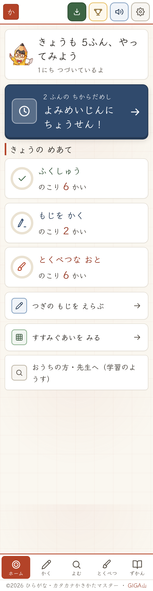

ホーム。きょうの めあては 毎日 おなじ 3つで、ぜんぶで 5分ていどです。

ホームで 子どもが きめるのは「どれから やるか」だけに してあります。1年生が 自分から はじめられないのは、やる気の ためではなく「なにを どこまで やれば おわりか」が 見えないからだ、と 考えたからです。めあては ふくしゅう 6もん、もじを かく 2かい、とくべつな おと 6もんの 3つ。日によって 変わりません。3つ そろうと カレンダーに 花丸の はんこが つきます。

## 📱 このアプリでできること

画面は 下の タブで 5つに 分かれています。もじを かく、ことばを よむ、とくべつな おと、ことばずかん、そして ホームです。

まず「かく」から 見ていきます。もじを えらぶと 五十音表が 下から 出てきます。ならびは 教科書と おなじ 五十音の ままにしました。

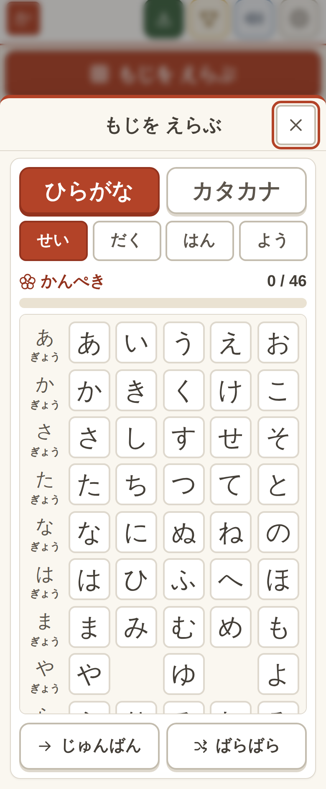

せいおん、だくおん、はんだくおん、ちいさい じ の 4つに 分かれています。ひらがな 46字、カタカナ 46字に 濁音や 小さい字を あわせて、あわせて 150字を 練習できます。

字を えらぶと、まず かきじゅんの アニメが 出ます。はやさは スライダーで 変えられるので、電子黒板で いっしょに 見るときは ゆっくりに してください。

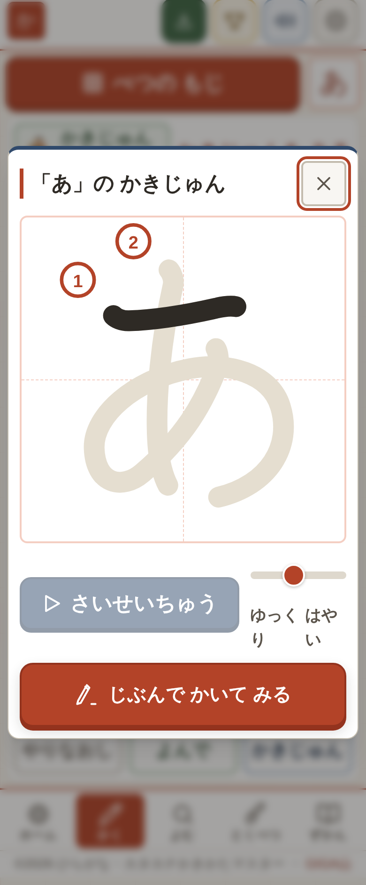

「あ」の かきじゅん。線が 1画ずつ 引かれていきます。

つぎは なぞり書きです。うすい お手本の 上を 2回 なぞります。書きはじめの ところには 赤い点が 出て、そこから 引きはじめないと 先に すすみません。

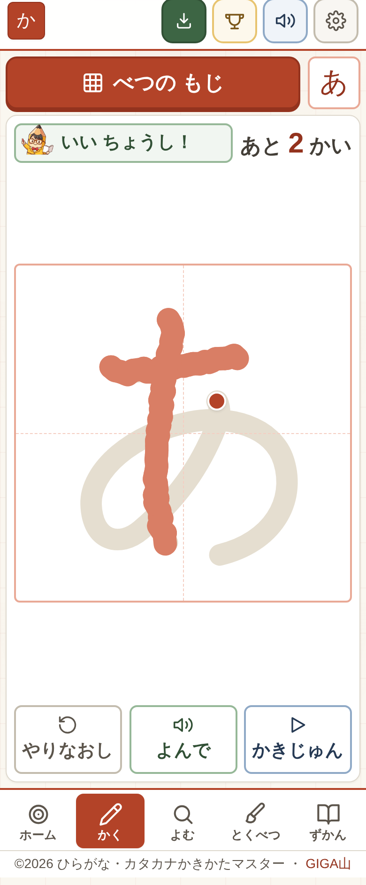

なぞっているところ。2画目まで 引けたので、つぎの 書きはじめに 赤い点が うつっています。

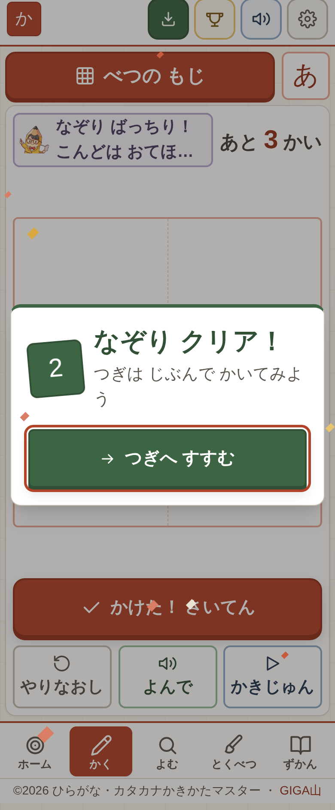

2回 なぞれると、はんこが おされて つぎの だんかいへ すすみます。

ここからが お手本なしの「じぶんで かく」です。うすい お手本は 消えて、マスと 中心の 線だけが のこります。

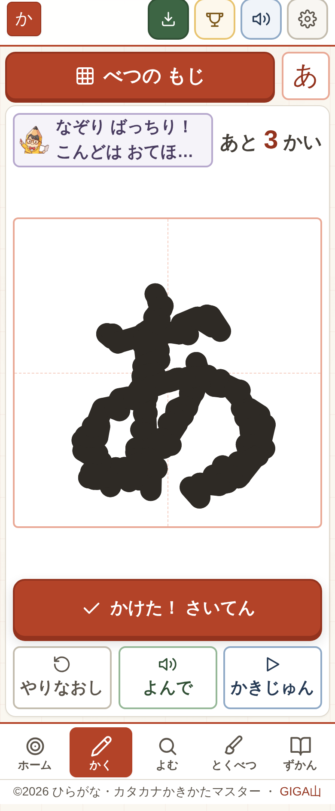

お手本の 消えた マス。ここに 3回 つづけて 書けたら 合格です。

書きおえて「かけた！ さいてん」を おすと、100点まん点で 採点します。ここが この アプリで いちばん 手を かけたところです。

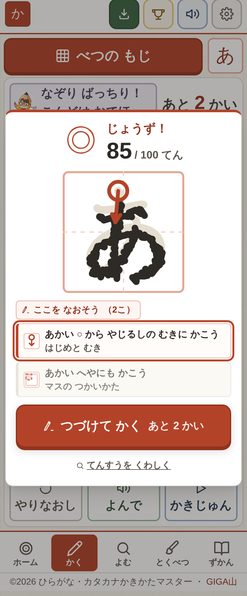

書いた字の 上に、先生が 赤ペンで 入れるのと おなじ しるしが つきます。

点数だけを 出しても、1年生には つぎに 何を すればいいか 分かりません。「はじめの ばしょと むきを みなおそう」と 書いてあっても、自分の 字の どこが そうなのかを 結びつけられないからです。そこで、まちがえた ところを 字の 上に 直接 しるします。○ で かこむ、やじるしで むきを しめす、正しい じゅんばんの 番号を ふる、お手本の 大きさの わくを 引く、という 具合です。

決めごとが 2つ あります。1つは、いちどに 見せるのは 1か所だけに すること。3つ かさねて 描くと 赤だらけに なって 何も 読めなくなります。もう 1つは、出すのを 多くて 3つまでに して、しかも「点が ひくい じゅん」ではなく「直して いちばん 点が のびる じゅん」に ならべること。同じ 半分の できでも、30点まん点の「せんの かたち」は 15点 落としていて、10点まん点の「せんの こうさ」は 5点しか 落としていません。効く ところから 見せたいのです。

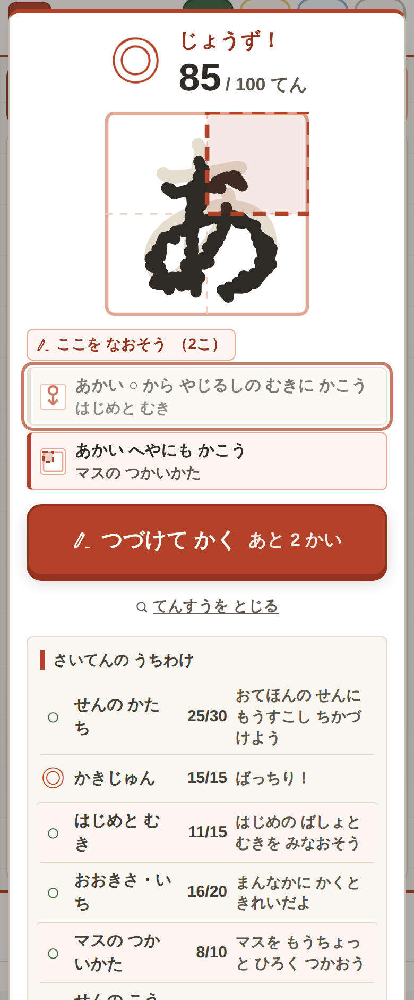

見ているのは 6つ。せんの かたちが 30点で いちばん おもく、かきじゅん、はじめと むき、おおきさ・いち、マスの つかいかた、せんの こうさ が つづきます。

「せんの かたち」を いちばん おもくしたのには わけが あります。これが なかった ころは、外がわの 形だけを 見ていたので、わくの 中を ぐちゃぐちゃに ぬりつぶした 字が 90点、下から 上へ 逆向きに 書いた 字が 85点に なっていました。明らかに 書けていないものが 花丸に なってしまうのです。いまは お手本の 線と どれだけ 重なっているかを 見ているので、逆向きも じゅんばんちがいも ぬりつぶしも はじけます。

いっぽうで、きびしすぎない ことも 大事に しました。1年生らしい ゆるい 手ぶれなら 落ちません。マスの 1割ちかく ゆがんでも 合格の 点に 収まるように 調整して あります。

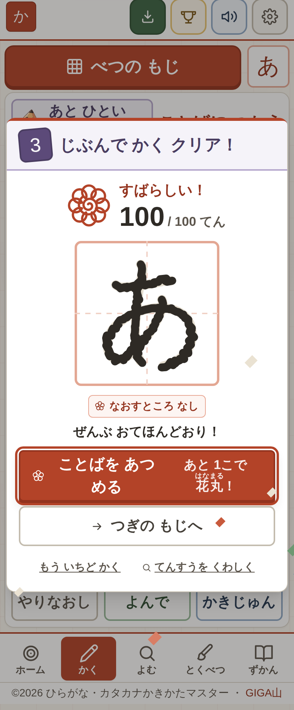

3回 つづけて 書けると、いったん 止まって ここまでの まとめが 出ます。

最後の だんかいは、その字を つかった ことばを 1つ あつめることです。書けるだけでは 終わりに しませんでした。字は ことばの 中で つかえて はじめて 身についた と 言えると 考えたからです。

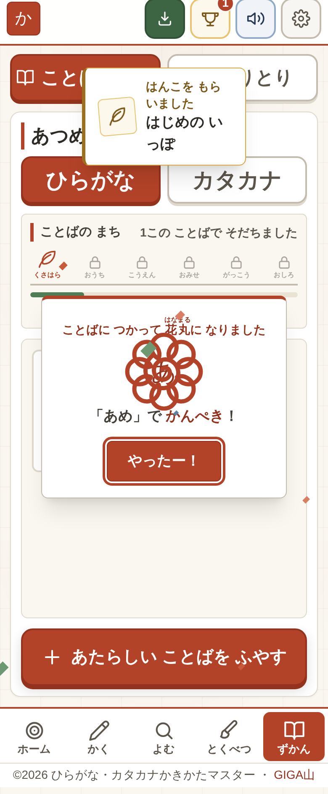

「あめ」を あつめて、「あ」が 花丸に なりました。

このアプリで いちばん 大事な しるしが、この 花丸です。まん中は うずまきに してあります。先生が 赤ペンで 書くときの、まん中から ぐるぐる まわす 手の うごきに あわせました。

あつめた ことばは ずかんに たまります。アプリが 知っている ことばなら、さしえと なかまが その場で 自動で つきます。

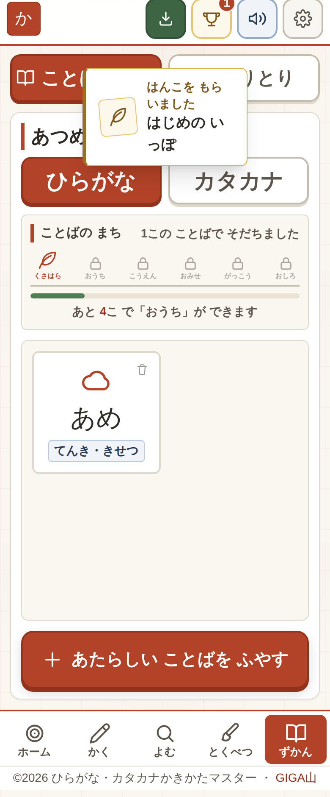

あつめた ことばが ふえると「ことばの まち」が そだちます。

ここには まだ 習っていない 字も つかえるように しました。ならった 字だけしか つかえないと、書きたい ことばが 書けません。書きたい 気もちの ほうを 先に 通しました。

ずかんの となりには、コンピュータとの しりとりも あります。

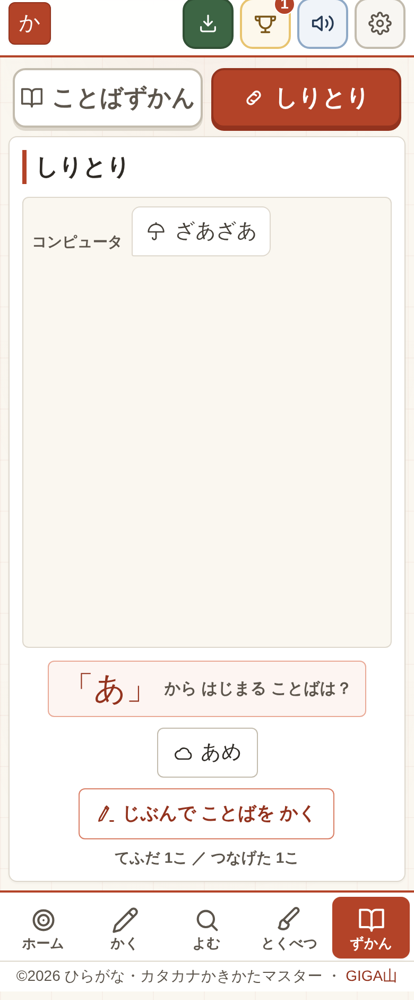

ずかんに ない ことばも その場で 書けます。書いた ことばは、あそんだ あと ずかんに 入ります。

「よむ」の 画面には 6つの コースが あります。1つの コースは 8もんです。

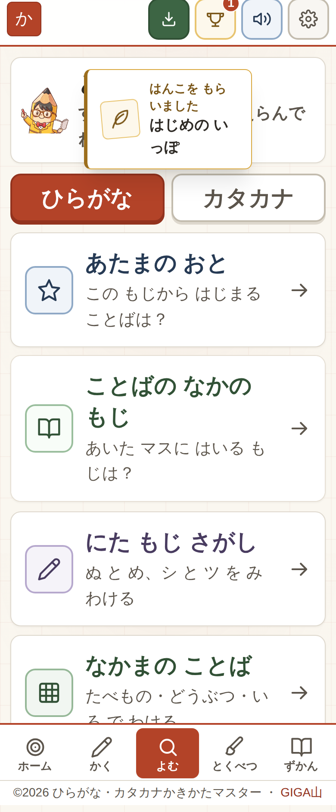

あたまの おと、ことばの なかの もじ、にた もじ さがし、なかまの ことば、はんたいの ことば、ぜんぶ まぜて の 6つです。

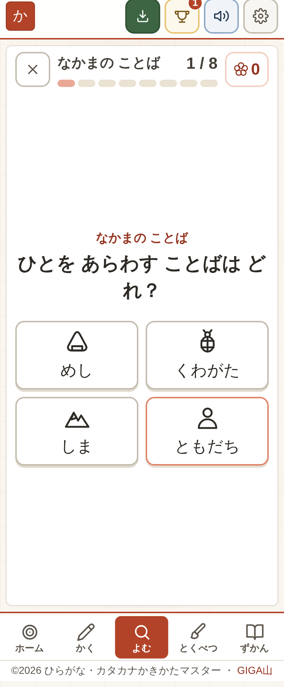

「なかまの ことば」。たべもの、どうぶつ、いろ、きもち など 24の なかまで 出します。

このアプリの ことばは 1,727語 あります。ひらがなが 1,066語、カタカナが 661語です。どの字にも 10語いじょう 入るように そろえてあるので、「ぬ」や「ゑ」のような 出にくい 字でも、ちゃんと ことばの 中で 練習できます。「はんたいの ことば」は 26組を 行きと 帰りの 両方で 出すので 52もんに なります。

## 💡 まん中に すえたのは、おとと マスの ずれ

ここからが、このアプリを 作った いちばんの 理由です。

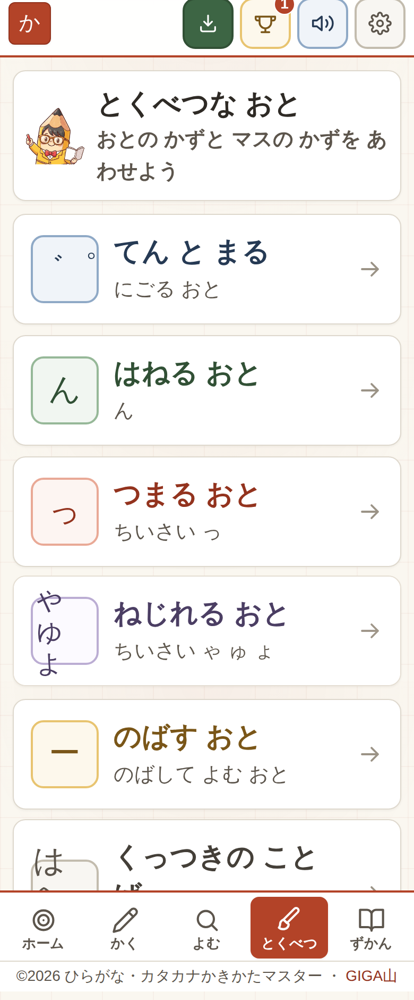

6つの ユニット。てん と まる、はねる おと、つまる おと、ねじれる おと、のばす おと、くっつきの ことば です。

どの ユニットも「まなぶ」と「といてみる」の 2つで できています。まなぶの 画面では、おとの かずを ドットで 見せます。

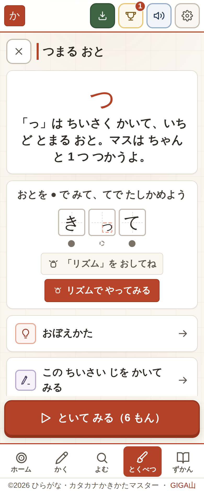

「きって」は マスが 3つ。でも ぬりつぶした ● は 2つで、まん中は 音を 出さない しるしに なっています。

ふつうの おとは ぬりつぶした ●、つまる おと「っ」は 音を 出さないので うすい ○、ねじれる おと「きゃ」は 2もじで ● 1つ、のばす おとは よこ線で まえの おとと つながる。この 4つの 見せかたで、マスの かずと おとの かずが ちがう ことが 一目で 分かります。「でんしゃ」なら マスは 4つ、おとは 3つです。

見るだけでは 体に 入らないので、手で リズムを とる 機能も つけました。

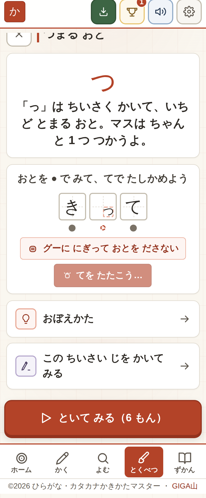

「っ」の ところだけ、グーに にぎって 音を ださない と 出ます。

ここが この 機能の かなめです。ふつうの おとは たたく、ねじれる おとは 2もじ まとめて 1回 たたく、のばす おとは よこに ひっぱる。そして つまる おとだけは にぎって 鳴らしません。「聞こえないのに 書く字が ある」ことを、耳と 手の 両方で つかまえてもらう ためです。

もんだいの かたちは 何とおりも 用意しました。

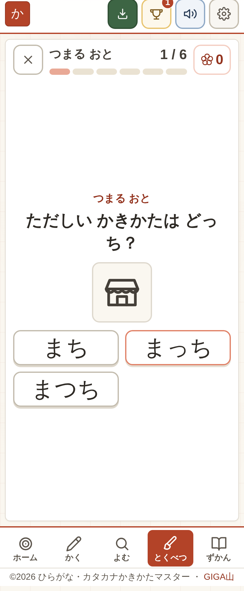

絵を見て 正しい つづりを えらぶ もんだい。まちがいの 札は、1年生が じっさいに 書く形を ことばごとに 手で 持たせています。

まちがいの 選択肢を 思いつきで 作らなかったのには 理由が あります。「ぽけっと」の まちがいなら「ぽけと」と「ぽけつと」というように、その子が 本当に 書きそうな 形でないと、まちがえた ときに 何も 教えられないからです。

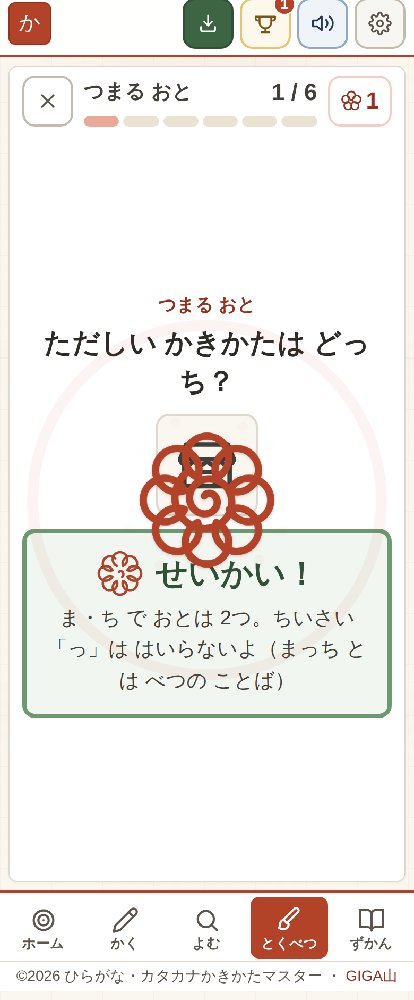

こたえあわせでは、かならず おとの かずに もどして 説明します。

この 画面で もう 1つ 気を つけたことが あります。もんだいの 3つに 1つは、こたえが とくべつな おとに ならない ことばを まぜている、ということです。「ねこ」「ぶた」「まち」「おばさん」のような ことばです。ぜんぶの こたえに 小さい「っ」が 入っていると、もんだいを 読まずに「ちいさい っ の ある ほう」を えらぶだけで 全問 当たってしまいます。それでは、この 単元が いちばん 教えたい「入るのか、入らないのか」の 見わけが 練習に なりません。

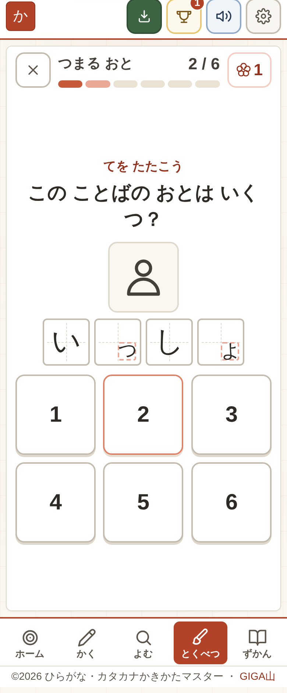

手を たたく かずを こたえる もんだい。ここが すべての 土台です。

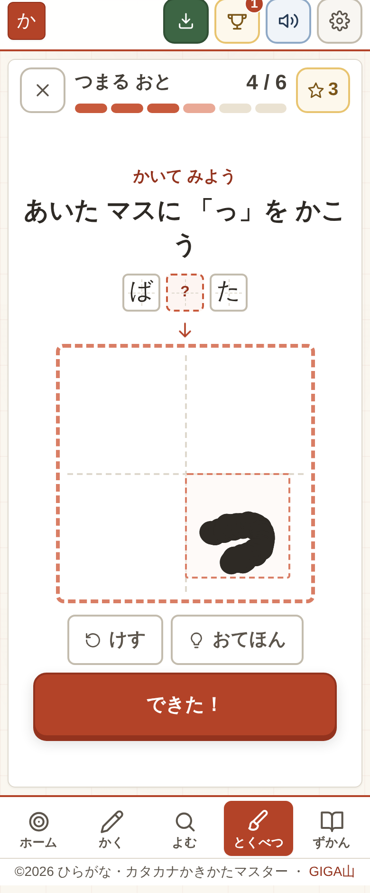

えらぶ ことと 書ける ことは べつなので、じっさいに マスに 書く もんだいも 入れました。

この かきとりの 採点は、「かく」の画面の 採点とは べつ物に してあります。あちらは 6つの 観点の 合計で 通るので、マスいっぱいの 大きな「つ」でも 合格しかねません。それでは この 単元が 教えている ことを 見のがします。ここでは 形、小さく 書けているか、右下の へやに 入っているかの 3つだけを 見ます。

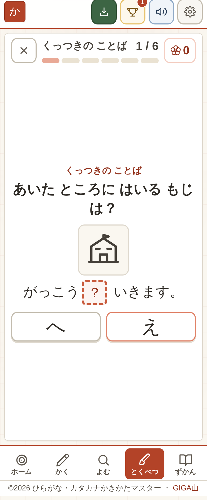

「は・へ・を」は、文の 中でしか 練習に なりません。

くっつきの ことばは 31の 文で 練習します。こちらにも、こたえが「わ・え・お」に なる 文を 9つ まぜてあります。「にわとり」の わ、「こうえん」の え、「おにぎり」の お です。ぜんぶの こたえが「は・へ・を」だと、めずらしい ほうの 字を えらぶだけで 当たってしまうからです。

## 🤝 2分の ちからだめしで、その子に あわせて 変わる

ここは 多層指導モデル MIM の 考えかたを お借りしました。読みの つまずきを 表に 出る 前に つかまえ、子どもごとに 指導の あつさを かえる モデルで、とくに 特殊音節に 焦点を あてている ところが、このアプリの ねらいと そのまま かさなります。

ホームから 入れる「よみめいじん」は、1分 かける 2回の みじかい 課題です。

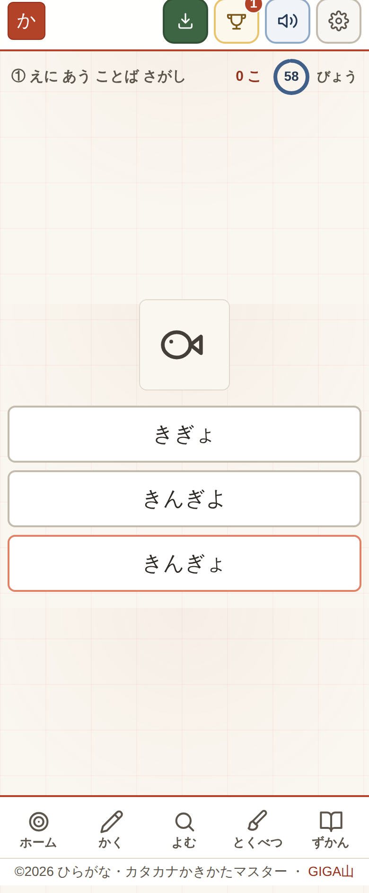

1つめは、絵に あう 正しい つづりを 3つから えらぶ 課題です。

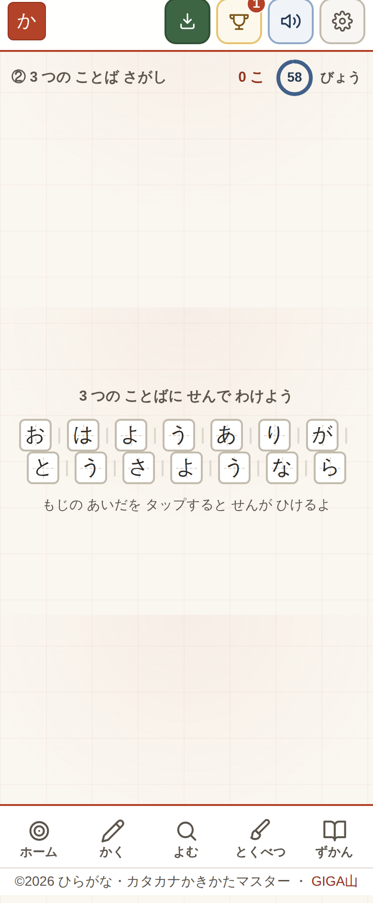

2つめは、つながった かなの ならびを 3つの ことばに 線で わける 課題です。

出しかたは MIM と おなじ 考えで、清音、濁音と半濁音、長音、促音、拗音、拗長音、カタカナ を 1まわりとして くりかえします。まちがいの 札も、形が にている、濁点の あるなし、語順の 入れかえ、音が にている、といった 作りかたに そろえました。

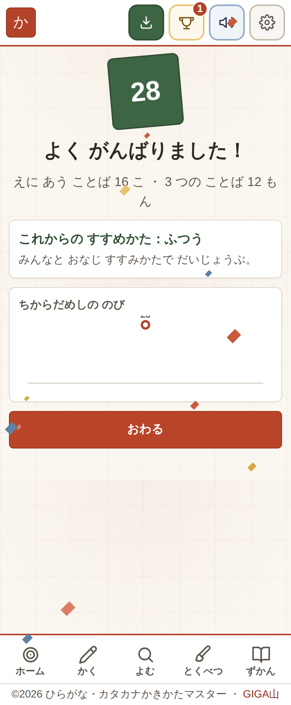

結果は かならず 折れ線で 出します。まえの じぶんと くらべた のびを 見るためです。

大事なのは、判定して 終わりに しなかった ことです。結果に あわせて、そのあとの「とくべつな おと」の 出しかたそのものが 変わります。ふつうの ステージは 6もんで 3つから えらびます。すこし ていねいな ステージは 5もんに へって えらぶのが 2つに なり、おとの ドットが つねに 出て、こたえた あとに リズムも 出ます。とても ていねいな ステージは 4もんに へり、あつかう ことばも しぼって、こたえる 前に リズムを 見せます。

ステージが 上がるほど、あつかう ことばを しぼって 同じものを くりかえします。まぐれで 当たる 余地を へらして、できたことが 積みあがるように するためです。「ちいさい か おおきい か」の 手がかりの 札も、ふつうの ステージでは 出しません。それを 出すと、「っ と つ、どっち」の こたえを 札が そのまま 教えてしまうからです。

なお、このステージの さかいめは このアプリ独自の めやすで、MIM-PM の 正式な 標準得点では ありません。画面にも そう 書いてあります。正式な 判定が 必要なときは、MIM の パッケージと 標準得点表を お使いください。

## ✨ 導入のメリット

三つの いいことが 期待できます。

一つ目は、丸つけに おわれなくなる ことです。字の 採点も、よみの もんだいも、その場で 自動で 返ります。とくに 書字の 直しは、これまで ノートを 集めて 一人ずつ 赤を 入れるしか ありませんでした。それが 書いた その場で、しかも 直して いちばん 効く ところから 1つずつ 返ります。先生の 手は、赤ペンを 走らせる ことから、つまずいている 子の となりに すわる ことへ うつせると 思います。

二つ目は、いちばん 教えにくい ところに 手が 届く ことです。特殊音節は、時間を かけて 教えたくても 教科書の 配当が 少ない ところです。ドットで おとを 見せ、手で リズムを とり、書いて たしかめる という 手だてを、1日 5分の 中に 入れてあります。「がっこう」が「がこう」に なる 子に、なぜ そこに 字が 入るのかを、ことばの しくみから 返せる ように なると 思います。

三つ目は、その子の いまが 見える ことです。ホームの いちばん下に、大人だけが 読む まとめが たたんで あります。学習日数、自分で 書ける 字の かず、復習まちの かずに くわえて、いま どの単元で つまずいているかが ことばで 出ます。学級の 全員の 顔を 思いうかべながら 指導を 組みなおすときの、手がかりの 1つに なるはずです。

## 🛠️ 【管理者向け】導入手順

情報担当の 先生に 聞かれそうな ことを、先に まとめておきます。

1. 校内の フィルタリングで、gigayama.github.io を 許可してください。アプリの 中身は すべて ここから 配られます。
2. できれば fonts.googleapis.com と fonts.gstatic.com も 許可してください。教科書体が 入っていない 端末のための 予備の 書体を ここから 読みます。ふさがれていても、字の 形が すこし 変わるだけで アプリは そのまま 動きます。
3. 端末に 入れる ときは、画面 右上の「アプリにする」を おします。Chromebook と Windows の Chrome や Edge、Android は そのまま 入ります。iPad と iPhone は 手順の 案内が 出るので、画面の 共有ボタンから「ホーム画面に追加」を えらんでください。
4. 一度 ひらいた 端末は、インターネットに つながっていなくても つかえます。アプリに 必要なものを ぜんぶ 中に 持っているためです。かきじゅんの データも 中に あります。
5. 音の あるなしは、画面 右上の スピーカーの ボタンで 切りかえます。教室で 一斉に つかうときは オフに すると 静かです。日本語の 音声が 入っていない 端末でも、もんだいは ぜんぶ とけるように 作ってあります。
6. 学級で 1台を まわして つかうときは、次の子に わたす前に 右上の 歯車から「さいしょから」を おしてください。記録は その端末の 中にだけ 残るので、消さないと 前の子の 記録の 上に つづきます。

個人情報は 持ちません。名前も 出席番号も メールアドレスも 入れる ところが ありません。記録は その端末の 中だけに 残り、どこにも 送信しません。ここは 保護者への 説明でも そのまま つかえると 思います。

導入前に ためすなら、まず 先生の 端末で 1文字 だけ 通してみてください。かきじゅんを 見て、なぞって、自分で 書いて、ことばを あつめる。ここまでで 3分ほどです。採点と 赤ペンの 返りかたが 分かれば、子どもに どう 声を かけるかも 決めやすく なります。

## 📖 【利用者向け】使い方のガイド

子どもに 説明するときの 順番です。

1. ホームを ひらきます。上に「きょうの めあて」が 3つ 出ています。毎日 おなじ 3つです。
2. どれから やっても かまいません。まよう 子には、いちばん上の 大きな ボタンを おすように 言ってください。アプリが つぎに やることを えらんでくれます。
3. もじを かく ときは「かく」の タブです。五十音表から 字を えらび、かきじゅんを 見て、2回 なぞって、3回 じぶんで 書きます。
4. 採点の 画面は、タップするまで 消えません。赤い しるしが 出たら、そこを 見てから「もう いちど かく」を おします。しるしの 一覧を おすと、その ばしょに うつります。
5. 3回 つづけて 書けたら、その字を つかった ことばを 1つ あつめます。ここまでで 花丸です。
6. とくべつな おとは「とくべつ」の タブです。まなぶ を 見てから といてみる を おします。まなぶの 画面で かならず「リズムでやってみる」を 1回 おさせてください。手で たたく ところが この 単元の かなめです。
7. まちがえた もんだいは、日を あけて もういちど 出ます。つぎの日、2日ご、4日ご、1しゅうかんご、2しゅうかんご、1かげつごの 順です。
8. まちがえたままの ものは、ホームの にがてボックスに ならびます。「ふくしゅう」を おすと そこから 先に 出るので、といていけば その日のうちに 消えます。

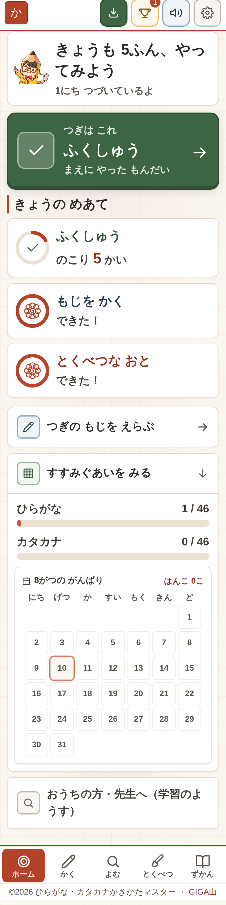

3つの めあてが そろった日には、カレンダーに 花丸の はんこが つきます。

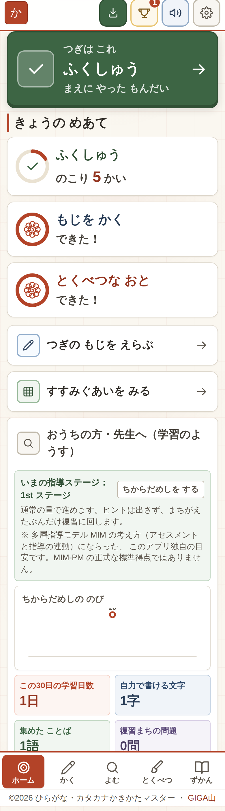

ホームの いちばん下に、大人だけが 読む まとめが たたんで あります。

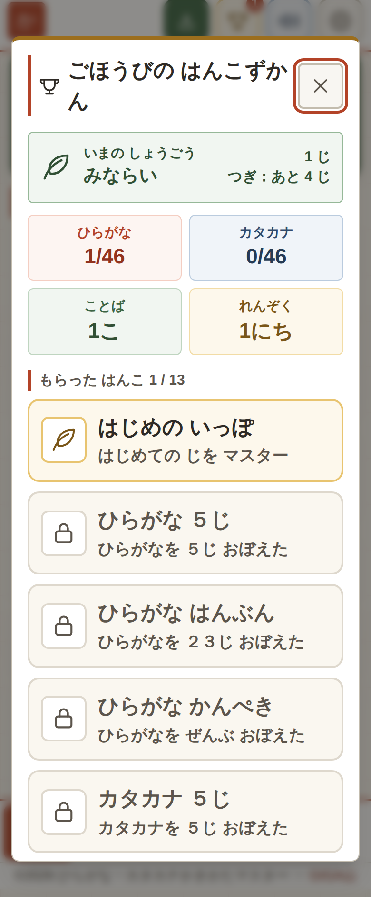

右上の トロフィーから、13この はんこと いまの しょうごうを 見られます。

2しゅうかん たつと、ホームに ちからだめしの さそいが もういちど 出ます。同じ 課題を 同じ 条件で もう一度 やることで、点数そのものより まえの じぶんと くらべた のびが 見えます。学期の はじめと おわりに そろえて とるのも いいかもしれません。

## 📝 まとめ

このアプリを 作りながら ずっと 考えていたのは、丸つけの 時間を へらすこと そのものが 目的では ない、ということでした。

「がっこう」が「がこう」に なる 子の となりに すわって、手を たたきながら 一緒に 数えてみる。「ほら、おとは 4つ あるでしょう」と 言ってみる。その 時間を どう 作るかが、ほんとうの ところだと 思います。丸つけを アプリに わたすのは、その 時間を 空けるための 手だてです。

だから この アプリは、正解と 不正解を 返して 終わりに しないように 作りました。書いた字の どこを 直せば いちばん 伸びるのかを 赤ペンで しめし、まちがえた ときは かならず おとの かずに もどして 説明します。先生が 子どもに 言うであろう ことを、できるだけ そのまま 画面に のせたつもりです。うまく いっていない ところも あると 思うので、つかってみて 気づいたことが あれば ぜひ 教えてください。

一歩踏み出そうとする先生を、私はいつでも全力で応援しています。
