# 教室で使えるかもしれないもの作り #◯ 「がっこう」が「がこう」になる。おとの かずを 目で かぞえられる ひらがな・カタカナ学習アプリ「かきかたマスター」

## 🏫 はじめに

1年生のノートを見ていて、こんな字に出あったことはありませんか。

がこう。でんしや。おとおさん。わたしわ。

一つひとつの字はていねいに書けています。それでも、耳で聞いたことばを紙に写すところでつまずいてしまう。しかも この つまずきは、書き取りの練習を何回くりかえしても、なかなか消えてくれません。

理由はわりとはっきりしています。「がっこう」を「がこう」と書く子は、字の形がわからないのではありません。耳で聞いた おとの かずと、紙のマスの かずが 結びついていないのです。だから、書ける字をふやす練習をしても、そこは変わりません。

作りはじめたときは、字の形と かきじゅん だけをあつかうつもりでいました。けれど、それだけでは「っ」や「ゃ」でつまずく子に届かないと思いなおし、おと と マス の関係をまん中にすえました。

小学1年生むけの ひらがな・カタカナ学習アプリ「かきかたマスター」です。字の形と かきじゅんはもちろん、1年生がいちばんつまずく「っ」「ゃゅょ」「ん」「のばす おと」「は・へ・を」を、おと と マスの関係からあつかいます。インストールも登録もいらず、記録はその端末の中だけに残ります。

ひらくところは、こちらです。

https://gigayama.github.io/KANA_Master/

ホーム画面。きょうのめあては毎日おなじ3つで、5分ほどです。

## 📱 このアプリでできること

このアプリは、1年生の国語で身につけることを4つに分けています。字を書くちから、字を読むちから、ことばのいみをつかむちから、そして とくべつな おとをあつかうちからです。この4つはたがいに代わりがききません。書けるのに読めない、読めるのに「がっこう」が「がこう」になる。そういうつまずきは、どれか1つしか練習していないとかならず起きるので、画面も記録もこの4つで分けてあります。

「かく」の画面では、五十音表からもじを1つえらびます。表は、せいおん、だくおん、はんだくおん、小さい字の4つに分かれます。ひらがな・カタカナそれぞれ46字に、濁音20字、半濁音5字、小さい ゃゅょっ の4字を足した75字ずつ、あわせて150字です。

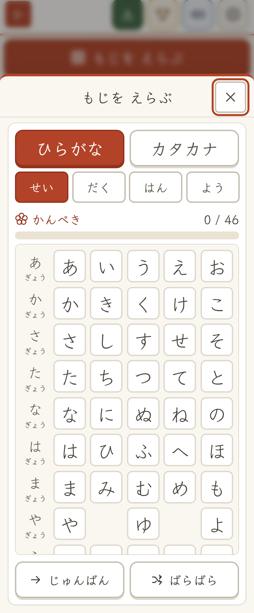

もじをえらぶ画面。見た目は教科書どおりの五十音です。

もじをえらぶと、まず かきじゅんのアニメが出ます。線が引かれていく速さはスライダーで変えられるので、ゆっくり見たい子はゆっくり見られます。

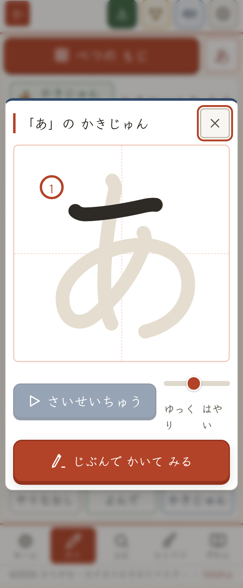

「あ」のかきじゅん。何秒でも見ていられます。

そのあとが、なぞり書きです。うすいお手本の上を赤えんぴつでなぞります。書きはじめには朱色の点が出て、まちがった順番で書こうとするとマスがひとゆすりして先へ進みません。2回なぞると、つぎの だんかいです。

なぞり書きの途中。つぎに書く画の書きはじめに朱色の点。

「よむ」の画面には6つのコースがあります。あたまの おと、ことばの なかの もじ、にた もじ さがし、なかまの ことば、はんたいの ことば、そして ぜんぶ まぜて。1コース8もんです。「にた もじ さがし」は ぬ と め、シ と ツ のような見分けにくい字を、「なかまの ことば」は ことばのいみを あつかいます。

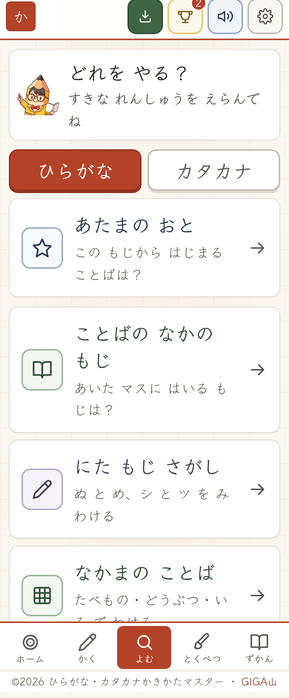

「よむ」のコース一覧。1コース8もん。

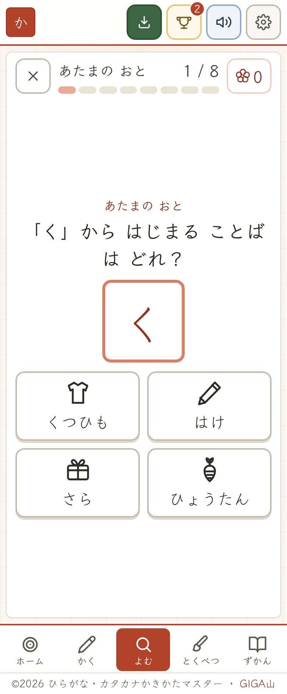

あたまの おと。もじ、おと、ことばを行き来させます。

「ずかん」は、子どもが自分でつくったことばの一覧です。なかまをえらんで、もじをならべて、ずかんに入れる。まだ習っていない字も使えます。書きたいことばが「習った字だけ」でできているとはかぎらないからです。

このずかんには、しかけを1つ入れました。アプリの中には1年生が1年間で出あうことばを1,727語もっていて、子どもが書いたことばがその中にあれば、さしえと なかまが その場でつきます。「いぬ」と書けば犬の絵と「どうぶつ」が、「でんしゃ」と書けば車の絵と「のりもの」がつく。自分で絵をえらばせるのではなく、書いたことばをアプリが受けとって返す形にしたかったのです。

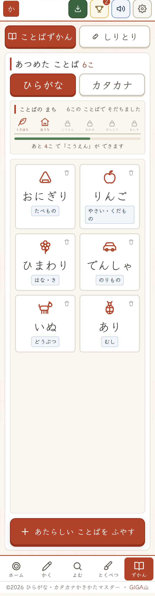

あつめたことば。さしえと なかまは アプリがつけます。

ずかんには、コンピュータとのしりとりもついています。ずかんにないことばも、その場で書いてこたえられて、あそんだあとずかんに入ります。

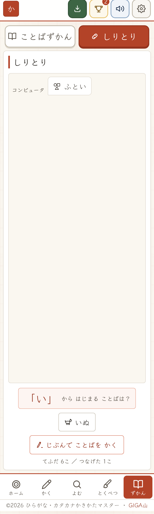

しりとり。手ふだから えらぶか、その場で書きます。

## 💡 「おと」と「マス」の ずれを 目で 見せる

ここが、いちばん作りたかったところです。

「とくべつ」の画面には6つの単元があります。てん と まる、はねる おと の「ん」、つまる おと の「っ」、ねじれる おと の「ゃゅょ」、のばす おと、くっつきの ことば の「は・へ・を」です。どれも「まなぶ」から「といてみる」へ進みます。

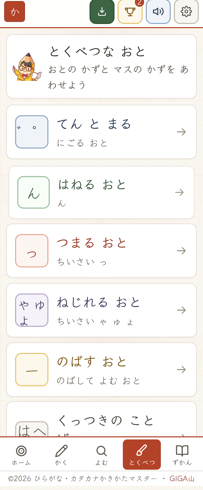

とくべつな おと の6つの単元。1年生のつまずきは、だいたいここに集まります。

「まなぶ」の画面では、ことばをマスにならべて、マスの下に丸をならべます。丸1つが、手を1回たたくぶんの おと です。ふつうの おと はぬりつぶした丸、つまる おと の「っ」は音を出さないので小さい点線の丸、ねじれる おと の「しゃ」は2文字で1つの おと なので、2マスの上に弧をかけて丸1つ。のばす おと は前の丸と横線でつながります。

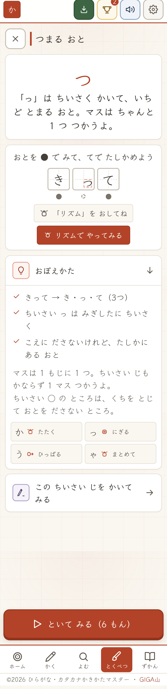

「きって」は き、っ、て で おと が3つ。小さい「っ」のところだけ丸が点線です。

これを入れたのは、「おとの かずと マスの かずは 同じではない」ということを、ことばで説明しても1年生には届かないと思ったからです。マスは1文字に1つ。小さい字も、聞こえなくても、かならず1マス使う。この2つを同時に見せられる方法が、丸をならべることでした。

いちばん はっきり見えるのは「じてんしゃ」です。マスは5つ、おと は4つ。この ずれ が画面に出ます。

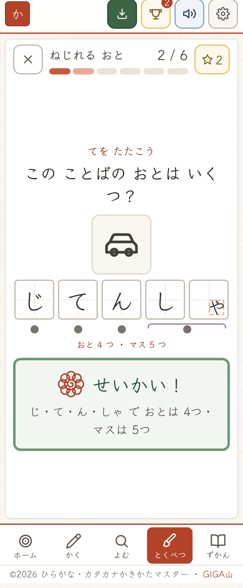

じてんしゃ は おと が4つ、マスは5つ。しゃ の2マスの上に弧がかかります。

丸を出すだけでは足りないので、手のうごきもつけました。「リズムでやってみる」を押すと丸が1つずつ光って、その おと でどう手を動かすかが出ます。ふつうの おと はたたく。つまる おと はグーににぎって、音を鳴らさない。のばす おと は横にひっぱる。ねじれる おと は2文字まとめて1回たたく。

つまる おと で音を鳴らさないところが、この機能のかなめです。「聞こえないのに書く字がある」ということを、耳と手の両方でつかんでほしいと思いました。

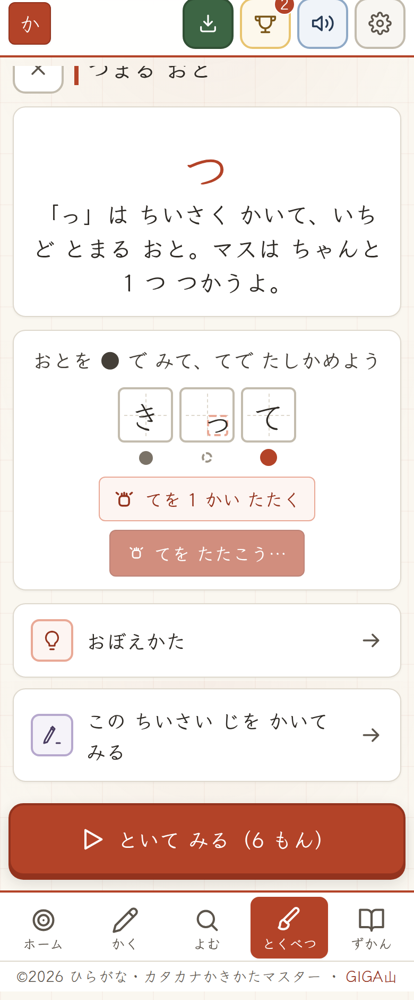

リズム。光る丸に合わせて、手をたたくかにぎるかが出ます。

「といてみる」では1セット6もんが出ます。絵を見て正しいつづりをえらぶもの、あいたマスに入る字をえらぶもの、おとの かずをこたえるもの、そして実際に字を書くものです。

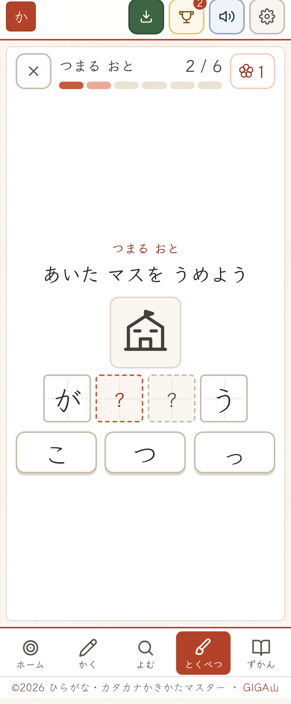

「がっこう」の あいた2マス。ふだ は こ、つ、っ の3つです。

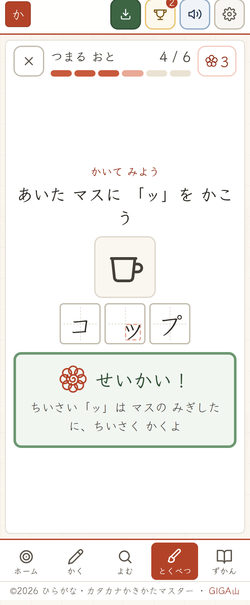

かいて みよう。1セットに1もんだけ、実際に書いてもらいます。小さい字はマスの右下に小さく、というところまで見ます。

このなかで、いちばん時間をかけたのは まちがいの ふだ です。「がっこう」の まちがいを「がこう」と「がつこう」にしてあるのは、1年生が実際にそう書くからです。思いつきの まちがいを置くと、正しいほうが一目でわかってしまい、練習になりません。

もう1つ仕掛けがあります。3もんに1もんくらいの割合で、こたえが とくべつな おと にならないことばがまざります。つまる おと の単元なら「ねこ」や「ぶた」、くっつきの ことば なら「にわとり」や「こうえん」です。

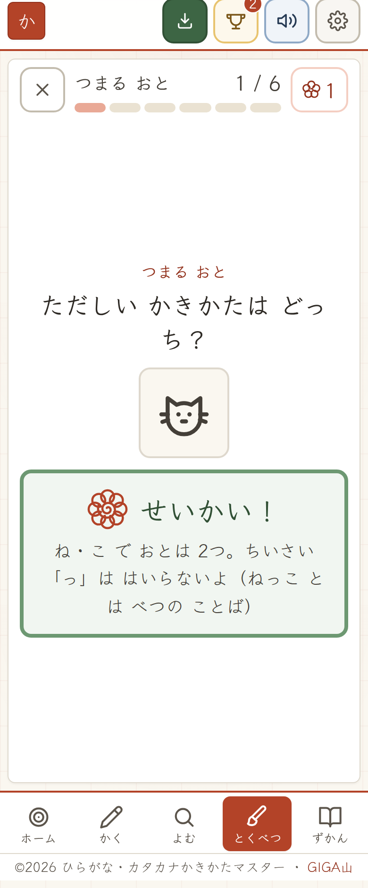

ねこ に 小さい「っ」は入りません。入るのか入らないのかの見分けが、この単元のねらいです。

これを入れないと、もんだいを読まずに「小さい っ のあるほう」をえらぶだけで当たってしまいます。それでは、この単元がいちばん教えたいところが、まったく練習になりません。

そして、この単元の出しかたはその子によって変わります。ホームからひらける2ふんのちからだめし「よみめいじん」の結果で、指導の手あつさが3つに分かれます。

ちからだめし①。絵に合う正しいつづりを1分えらびます。

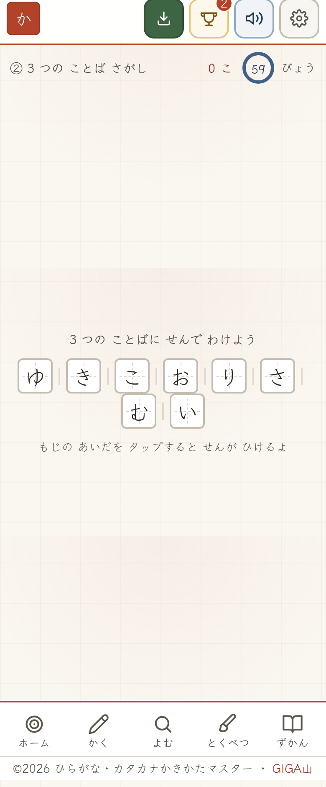

ちからだめし②。つながったかなを3つのことばに線で分けます。

点数よりも、前の自分とくらべたのびを見るものなので、結果は折れ線で出ます。

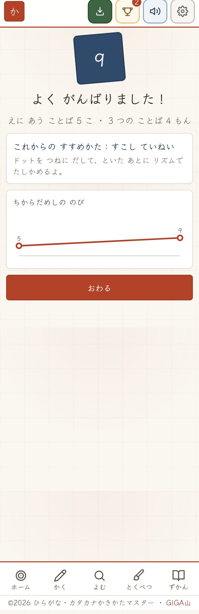

結果の画面。点数と、これからの すすめかた。

結果によって変わるのは、もんだいの かず、あつかうことばの かず、えらぶ ふだ の かず、あける マスの かず、そして 丸 と リズム を出すかどうかです。手あつくするステージでは、ことばをしぼって同じものをくりかえします。まぐれで当たる余地をへらしたかったからです。ただし、くりかえすのはことばで、もんだいの形ではありません。おなじことばでも、えらぶ・マスにいれる・おとをかぞえる・書く、と形が変わるように組んであります。

ここは、多層指導モデル MIM という考え方をお借りしました。読みのつまずきを、はっきり出てくる前につかまえて、子どもごとに指導の あつさを変えるという考え方です。判定して終わりにせず出題そのものを変えるところまでやらないと意味がないと思ったので、そこは そのとおりに作りました。ただし ステージの さかいめ の点数は このアプリ独自の目安で、MIM-PM の正式な標準得点ではありません。

## ✏️ 採点を 赤ペンで かえす

「かく」の3つめの だんかい は、お手本なしで書くところです。ここは自動で採点します。

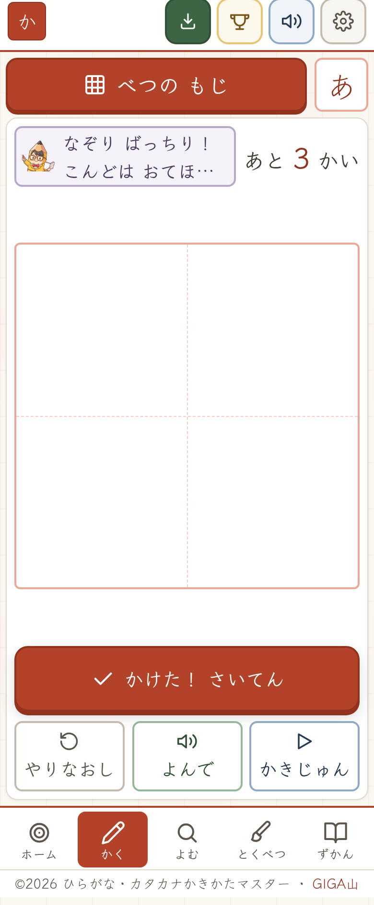

お手本の消えた画面。ここからは自分の記憶で書きます。

100点満点で、見ているのは6つです。せんの かたち が30点、かきじゅん が15点、はじめと むき が15点、おおきさ・いち が20点、マスの つかいかた が10点、せんの こうさ が10点。いちばん重いのは せんの かたち です。

ここを重くしたのには理由があります。はじめは書きはじめの場所や外形といった あらい特徴だけを見ていて、外形のなかをぐちゃぐちゃにぬりつぶした字が90点、逆向きに書いた字が85点になってしまいました。書けていないものが花丸になる採点は、子どもに嘘をつくことになります。いまは、お手本と自分の線を同じ進みぐあいの場所どうしで順にくらべているので、逆向きも順番ちがいも ぬりつぶし も、いちどにはじけます。

いっぽうで、きびしすぎないことも大事にしました。1年生らしい手ぶれなら、マスの1割ほどゆがんでいても合格します。

点数のうちわけは文字でも出しますが、それだけでは足りませんでした。1年生はまだ ひらがなをおぼえている最中なので、「はじめの ばしょと むきを みなおそう」と読んで、自分の字のどこがそうなのかを結びつけられません。

そこで、先生が赤ペンで ○ をつけるのと同じことを画面でやりました。いちばんずれた線を赤でなぞって ○ でかこむ。正しい書きはじめに ○ をつけて、進む向きに やじるしを引く。お手本の大きさに赤い点線のわくを出す。文字を読まなくても、どこをどう直すかがわかります。

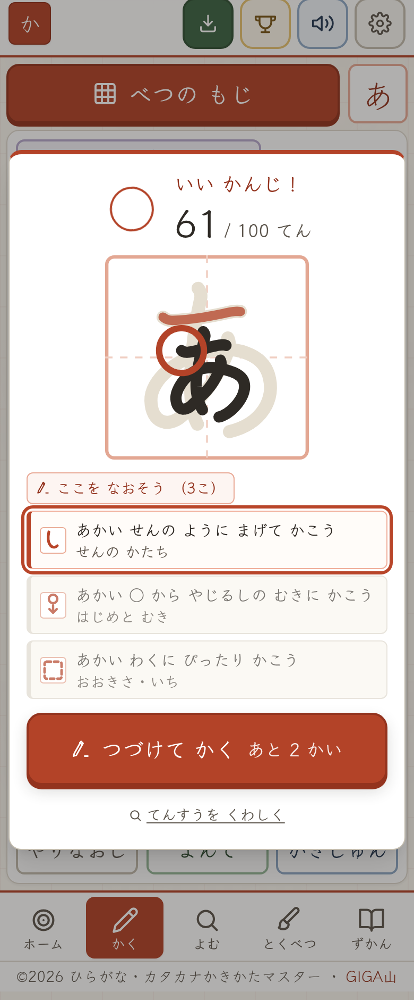

小さく書いた「あ」。直すところが3つならび、いま見せている1か所だけに赤が入ります。

決めごとを3つ置きました。いちどに見せるのは1か所だけ。かさねて描くと赤だらけになって、なにも読めなくなります。出すのは多くて3つまでで、ならべる順は点がひくい順ではなく、直していちばん点がのびる順です。そして、文はかならず自分のしるしの形を名ざしします。「あかい ○ から」「あかい わくに」と書いてあれば、どのしるしのことかがたどれます。

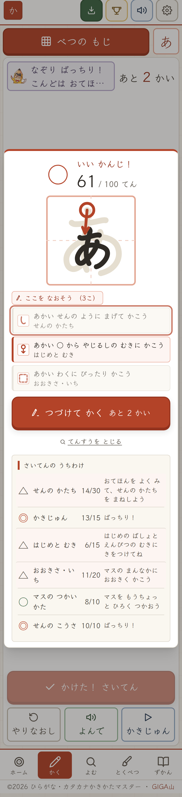

てんすうを くわしく。6つの観点それぞれの点と、気をつけることが出ます。

採点の画面は、タップするまで消えません。1年生が読むには数秒では足りないからです。かわりに、つぎに何をすればよいかのボタンが1つ大きく出ます。

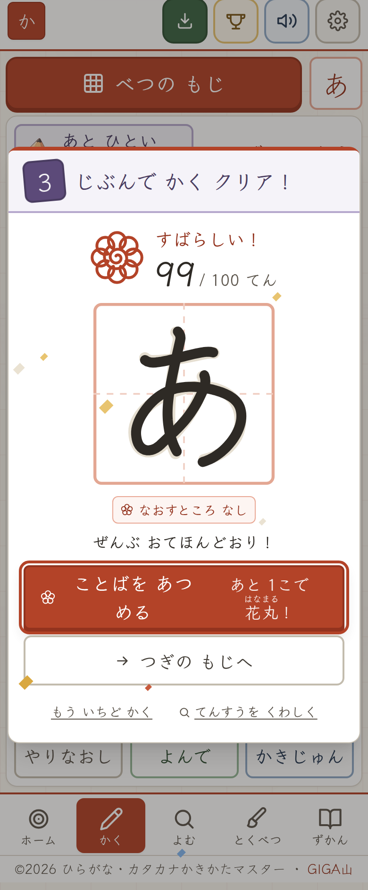

3回つづけて書けたところ。ここで止まり、つぎの1手だけを示します。

お手本なしで3回つづけて書けたら、そのもじを使ったことばを1つあつめて花丸です。字が書けることと、その字をことばの中で使えることは べつ なので、最後の だんかい をことばあつめにしました。

## ✨ 導入のメリット

三つのいいことが期待できます。

一つ目は、丸付けから手が離れるところが出てくることです。字の形もかきじゅんも、そしてとくべつな おとのもんだいも、その場で採点してその場で返します。しかも「なにが ちがうか」を赤ペンのしるしで返すので、先生がとなりについて説明しなくても、子どもが自分で直すところを見つけられます。ノートを集めて次の日に返すという回りかたから、少しだけ自由になれるのではないかと思います。

二つ目は、つまずきのある子が、その子のペースで手あつく練習できることです。ちからだめしの結果で、もんだいの かず も ことばの かず も えらぶ ふだ の かず も変わります。教室で「みんなおなじ量、おなじ速さ」にならざるをえない部分を、ここで補えるのではないかと思っています。

三つ目は、おぼえたことが消えないうちにもういちど出てくることです。「1回できた」で終わりにせず、つぎの日、2日後、4日後、1週間後、2週間後、1か月後と、間をあけてもういちど出します。まちがえたものははじめにもどって、ホームの にがてボックスにならびます。ふくしゅうを押すと にがてから先に出るので、その日のうちに にがてボックスは消えます。

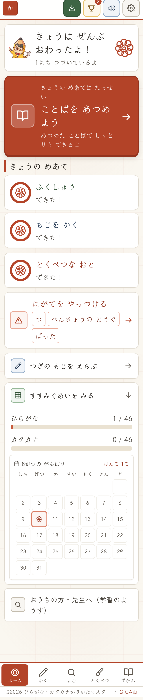

記録がたまったあとのホーム。にがてボックスと はんこカレンダー。

ごほうびもつけました。連続で練習した日数、字をおぼえた かずで変わる しょうごう、そして13この はんこです。3つのめあてがそろった日には、カレンダーに花丸の はんこが おされます。

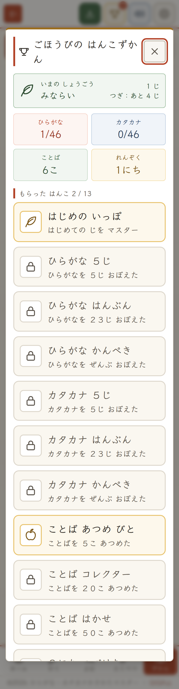

ごほうびの はんこずかん。いまの しょうごうと、もらった はんこ。

## 🛠️ 【管理者向け】導入手順

情報担当の先生に確認されそうなことを、先に書いておきます。

ひらくところは、ここです。登録もログインもいりません。

https://gigayama.github.io/KANA_Master/

つぎに、校内フィルタリングで許可するアドレスです。必要なのは gigayama.github.io だけで、アプリを動かすものはすべてこの中に入れてあります。

もう1つ、書体のために fonts.googleapis.com と fonts.gstatic.com を読みにいきます。こちらは見た目だけの読みこみなので、ふさがれていても字の形が変わるだけで、アプリはそのまま動きます。急いで許可を通す必要はありません。

以前はアプリを動かす部分を外のサイトから取っていて、そこがふさがれると画面が白いままでした。いまはその作りをやめて、必要なものをぜんぶ中に持っています。

通信と個人情報のあつかいです。記録はその端末の中だけに残ります。どこにも送信しません。名前、出席番号、メールアドレスは持ちません。外へ通信しない設定をページ側にも書いてあるので、うっかり外に出ることもありません。

アプリとして端末に入れるやり方です。

画面右上の「アプリにする」を押すと、ホーム画面にアイコンが作られます。インターネットがつながらなくても使えるようになり、アドレスバーが消えて画面がひろく使えます。

端末によってやり方がちがいます。

1. Chromebook、Windows の Chrome と Edge は、「アプリにする」を押します。出ないときは、アドレスバー右はしにあるインストールのしるしから入れられます。
2. Android の Chrome は、「アプリにする」を押します。出ないときは、右上の点が3つたてにならんだボタンから「アプリをインストール」を選びます。
3. iPad と iPhone の Safari は、「アプリにする」を押すと手順の案内が出ます。実際の操作は、共有ボタンから「ホーム画面に追加」です。Safari のしくみ上、ボタンだけでは入りません。

iPad で1つ気をつけることがあります。Safari は、7日間ひらかなかったアプリの記録を消すことがあります。ホーム画面に追加しておくと消えにくくなります。長いおやすみの前には、大事な記録をメモしておくと安心です。

共用の端末で使うときに、1つだけお願いがあります。1台をまわして使うと、前の子の記録の上につづいてしまいます。次の子にわたす前に、右上の歯車ボタンから「さいしょから」を押してください。消えるのはこのアプリの記録だけです。

音のことです。右上のスピーカーボタンで、音のオン・オフを切りかえます。はじめはオンなので、教室で一斉に使うときはオフにすると静かです。日本語の音声が入っていない端末でも、もんだいはぜんぶとけます。絵とことばとマスだけで成り立たせて、音声はそえものにしてあります。

書体のことです。画面に出る字は、UD デジタル教科書体にそろえています。Windows 10 以降には標準で入っています。入っていない端末では にた形のべつの書体で出ますが、練習はそのままできます。お手本と かきじゅんアニメと採点は、書体ではなく かきじゅんのデータから描いているので、端末でお手本の形が変わることはありません。

アプリがあたらしくなったときのことです。画面の下に「あたらしい ばんが あります」と出たら、「さいしんに する」を押してください。押すまで切りかわりません。書きかけの字が消えないように、わざとそうしてあります。

印刷と電子黒板のことです。印刷して配るための画面はありません。Ctrl+P で A4 たてになり、ボタンやおしらせは紙に出ないようにしてあります。電子黒板で見せるときは、ブラウザの表示倍率を上げてください。拡大は制限していないので、見えづらい子はピンチで大きくできます。

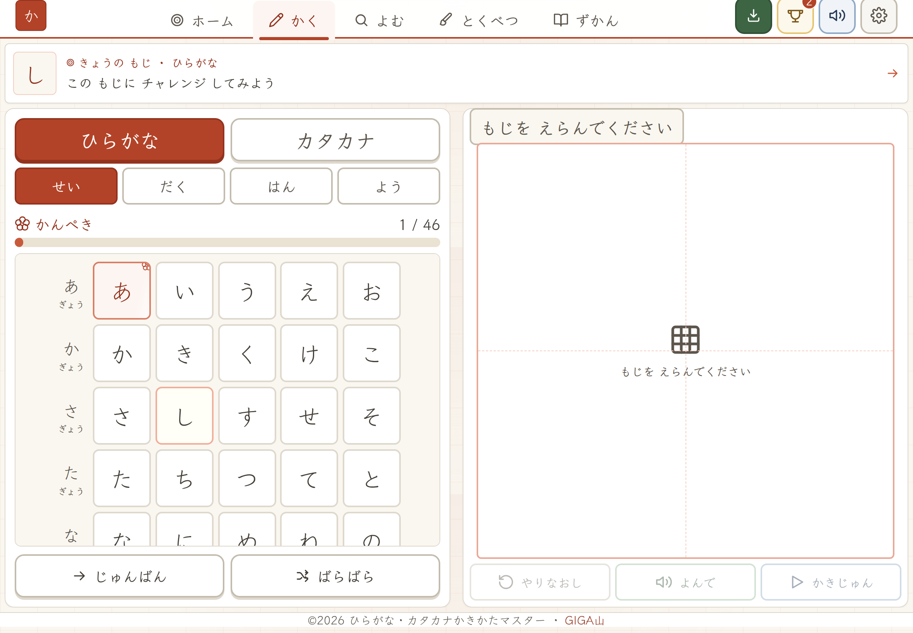

パソコンとよこ向きでは、もじの表と書くところが左右にならびます。

## 📖 【利用者向け】使い方のガイド

はじめて使う子には、この順にすすめると迷いません。

1. https://gigayama.github.io/KANA_Master/ をひらきます。
2. 画面右上の「アプリにする」を押して、ホーム画面に入れます。
3. ホームの「きょうの めあて」を上から見ます。ふくしゅう6もん、もじを かく2かい、とくべつな おと6もん の3つです。
4. はじめての日は「もじを かく」から押します。アプリが えらんだ字が出るので、そのままかきじゅんを見て、なぞって、自分で書きます。
5. お手本なしで3回つづけて書けたら、「ことばを あつめる」を押して、その字を使ったことばを1つ作ります。ここで花丸です。
6. つぎに「とくべつな おと」を押します。単元を1つえらんで、「まなぶ」で丸とリズムを見てから「といてみる」に進みます。
7. 「ふくしゅう」は、前にやったもんだいが出てきます。押すとすぐはじまります。
8. 3つそろうと、カレンダーに花丸の はんこが おされます。ここまでで5分ほどです。

2週間ほどたつと、ホームに「よみめいじんに ちょうせん」というさそいが出ます。あわせて2ふんで終わるので、朝の会のあとなどに1回入れておくと、もんだいの出しかたがその子に合ったものに変わります。

先生とおうちの方が見るところは、ホームのいちばん下にたたんであります。

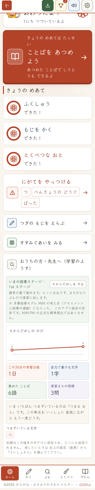

いまの指導ステージ、ちからだめしの点数のうつりかわり、この30日の学習日数、自分で書けるもじの かず、ふくしゅうまちの かず、そして いま どの単元でつまずいているかが出ます。

ここは大人が読むところなので、漢字のままにしてあります。子どもが見る画面には漢字を出さないというきまりを守っているので、「お手本」は「おてほん」、カレンダーの曜日は「にち げつ か」と書いています。例外は「花丸」だけです。しるしそのものの名前なので、漢字のままふりがなをふっています。

## 📝 まとめ

このアプリを作りながら、ずっと考えていたことがあります。丸付けが速くなることそのものは、たいして大事ではないということです。

大事なのは、そこで空いた時間で先生が子どもの顔を見られることだと思っています。「がっこう」を「がこう」と書いた子に、なぜそう書いたのかを聞ける時間。手を止めている子のとなりにすわって、いっしょに手をたたいてみる時間。それは、どれだけ機械が速くなっても機械にはできないことです。

だからこのアプリは、丸付けと、間をあけたふくしゅうと、その子に合った量の調整という、機械にまかせられるところだけを引きうけました。子どもがどこでつまずいているかは、ホームのいちばん下にことばで出ます。そこから先、その子にどう声をかけるかは、先生の仕事のままにしてあります。

まずはご自分の端末で、「とくべつな おと」の「つまる おと」を1つだけといてみてください。丸が3つならんで、真ん中の1つだけが点線になる画面を見ていただければ、このアプリが何をしたいのかは伝わると思います。

うまくいかないことがあれば、どの端末で、どの画面で、なにを押したときに起きたかをメモしてお知らせください。直します。

一歩踏み出そうとする先生を、私はいつでも全力で応援しています。
